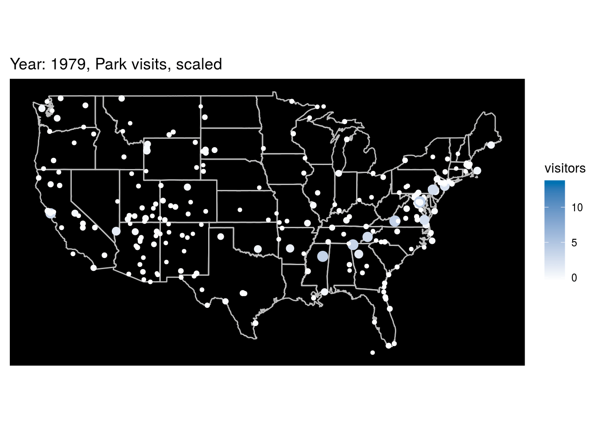

```{r loading-libraries, message=F}
library(flexdashboard)
library(devtools)
library(tidyverse)
library(gganimate)
library(gifski)
library(png)
library(here)
library(lemon)
library(RColorBrewer)
library(scales)
library(janitor)
library(ggrepel)
library(ggvoronoi)
# library(ggtext)
library(rvest)
library(fuzzyjoin)
library(jkmisc)
library(ragg)
```


```{r import-dataset, message=FALSE}
#park_visits <- readr::read_csv("https://raw.githubusercontent.com/rfordatascience/tidytuesday/master/data/2019/2019-09-17/national_parks.csv")
park_visits <- read_csv("data/national_parks.csv")
#state_pop <- readr::read_csv("https://raw.githubusercontent.com/rfordatascience/tidytuesday/master/data/2019/2019-09-17/state_pop.csv")
state_pop <- read_csv("data/state_pop.csv")
#gas_price <- readr::read_csv("https://raw.githubusercontent.com/rfordatascience/tidytuesday/master/data/2019/2019-09-17/gas_price.csv")
#gas_price <- readr::read_csv("data/gas_price.csv")
park_locations <- read.csv("data/NationalParksLatLong.csv")
```

### Park Locations


Plotting the locations of the various national parks

```{r most-popular-national-park-locations-GIS}
library(sp)
library(leaflet)
coordinates(park_locations) <- ~Longitude+Latitude
leaflet(park_locations) %>% addMarkers() %>% addTiles()
```

*** 

Source: https://github.com/spren9er/tidytuesday/blob/master/tidytuesday_201938_national_park_visits.r
Improvments seen below are discussed here: https://evancanfield.netlify.com/posts/2019-09-16-national-parks-tidytuesday/tidy-tuesday-38/


### Park change year over year

```{r include=T}
pv_ch <- park_visits %>% 
  distinct(year, unit_name, unit_type, visitors) %>% 
  filter(unit_type == "National Park" & year != "Total") %>%
  mutate(year = as.numeric(year)) %>% 
  group_by(unit_name) %>% 
  arrange(year, .by_group = TRUE) %>%
  mutate(yoy = visitors - lag(visitors)) %>% 
  filter(unit_name != "Denali National Preserve")
  
 
pv_ch %>%
  ggplot() +
  geom_line(aes(x = year, y = yoy, group = unit_name), size = 0.2) +
  scale_x_continuous(breaks = seq(1910, 2010, 10), expand = expand_scale(add = c(5, 1))) +
  scale_y_continuous(breaks = c(-3000000, 0, 1000000), labels = paste0(c(-3000000, 0, 1000000)/1000000, "M")) +
  facet_wrap(vars(unit_name), ncol = 3) +
  labs(
    title = "National Park Visits 1904–2016",
    subtitle = "Year-over-year change in total visits by park",
    caption = "Source: dataisplural/data.world | Graphic: Georgios Karamanis"
  ) +
  theme_void(base_family = "Times New Roman") +
  theme(
    legend.position = "none",
    legend.title = element_text(size = 20, color = "grey20"),
    legend.margin = margin(0, 0, 20, 0),
    plot.background = element_rect(fill = "grey80", color = NA),
    strip.background = element_rect(fill = "grey80", color = NA),
    strip.text = element_text(family = "Times New Roman", color = "grey30",
                               hjust = 1, vjust = 1),
    plot.title = element_text(size = 28, color = "grey20", family = "Times New Roman"),
    plot.subtitle = element_text(size = 20, color = "grey20", margin = margin(5, 0, 30, 0)),
    plot.caption = element_text(size = 8, color = "grey30", margin = margin(20, 0, 0, 0)),
    axis.text.x = element_text(family = "Times New Roman", size = 7, color = "grey40"),
    axis.text.y = element_text(family = "Times New Roman", size = 7, color = "grey40"),
    panel.grid.major.x = element_line(color = "grey75"),
    panel.grid.major.y = element_line(color = "grey75"),
    plot.margin = margin(20, 20, 20, 20)
  )
```

*** 

### Park visits over time
Source: https://github.com/spren9er/tidytuesday/blob/master/tidytuesday_201938_national_park_visits.r
Improvments seen below are discussed here: https://evancanfield.netlify.com/posts/2019-09-16-national-parks-tidytuesday/tidy-tuesday-38/

```{r include=T}
park_visits <- park_visits %>%
  mutate(
    parkname =
      if_else(
        is.na(parkname),
        str_trim(str_remove(unit_name, 'National Park')),
        parkname
      )
  )

highlight_parks <- c(
  'GREAT SMOKY MOUNTAINS',
  'GRAND CANYON',
  'ROCKY MOUNTAIN',
  'YOSEMITE',
  'YELLOWSTONE',
  'ZION',
  'ACADIA',
  'DENALI',
  'HOT SPRINGS',
  'CARLSBAD CAVERNS',
  'GREAT BASIN'
)

highlight_colors <- c(
  '#223e15',
  '#176785',
  '#499989',
  '#5fa73f',
  '#ff8706',
  '#ff534e',
  '#f5b901',
  '#9a91fa',
  '#c988d2',
  '#6da5c2',
  '#fe43bc'
)

ranking_parks <- park_visits %>%
  filter(
    year != 'Total',
    unit_type == 'National Park',
    !is.na(parkname),
    unit_name != 'Denali National Preserve'
  ) %>%
  mutate(
    year = as.integer(year),
    parkname = str_to_upper(parkname)
  ) %>%
  filter(year < 2016) %>%
  group_by(year) %>%
  arrange(year, desc(visitors)) %>%
  mutate(rank = row_number()) %>%
  ungroup()

top_parks <- ranking_parks %>%
  filter(parkname %in% highlight_parks) %>%
  mutate(parkname = fct_relevel(str_to_upper(parkname), highlight_parks)) %>%
  arrange(year, desc(parkname))

other_parks <- ranking_parks %>%
  filter(!parkname %in% highlight_parks)

animation <- top_parks %>%
  ggplot(aes(x = year, y = rank, group = parkname, color = parkname)) +
  geom_line(
    data = other_parks, size = 0.5, show.legend = FALSE, color = '#dadada'
  ) +
  geom_line(show.legend = FALSE, size = 0.8) +
  geom_text(
    aes(x = year + 0.8, label = parkname),
    size = 4.5, show.legend = FALSE, hjust = 0, fontface = 'bold'
  ) +
  scale_x_continuous(breaks = c(1925, 1950, 1975, 2000)) +
  scale_y_continuous(
    breaks = c(1, 25, 50), labels = c('1ˢᵗ', '25ᵗʰ', '50ᵗʰ'), trans = 'reverse'
  ) +
  scale_color_manual(values = highlight_colors) +
  coord_cartesian(clip = 'off') +
  transition_reveal(year, keep_last = TRUE) +
  labs(
    title = 'The most popular national park_visits',
    subtitle = 'National park_visits ranked by number of visitors in a given year',
    x = '',
    y = 'Rank',
    caption = '#tidytuesday 38|2019  •  © 2019 spren9er'
  ) +
  theme(
    plot.background = element_rect(fill = '#f0f0f0'),
    plot.margin = margin(t = 40, r = 155, b = 20, l = 20),
    plot.title = element_text(
      margin = margin(b = 8), size = 38, hjust = -0.17, face = 'bold',
      color = '#333333'
    ),
    plot.subtitle = element_text(
      margin = margin(t = 6, b = 5), size = 29, hjust = -0.72,
      face = 'plain', color = '#333333'
    ),
    plot.caption = element_text(
      color = '#999999', size = 13, margin = margin(t = 10), hjust = 0.5,
      face = 'plain', family = 'Decima Mono Pro'
    ),
    panel.background = element_rect(fill = '#f0f0f0'),
    panel.grid.major = element_line(size = 0.5, color = '#d3d3d3'),
    panel.border = element_blank(),
    axis.text.x = element_text(
      family = 'Decima Mono Pro', color = '#999999', face = 'plain', size = 20,
      margin = margin(t = 6)
    ),
    axis.text.y = element_text(
      family = 'Decima Mono Pro', color = '#999999', face = 'plain', size = 20,
      margin = margin(r = 6)
    ),
    axis.title.y = element_text(color = '#333333', face = 'bold', size = 16)
  )

animate(animation, width = 1000, height = 1000, end_pause = 30)

anim_save('images/tidytuesday_201938_national_park_visits.gif')
```

*** 

### Park yearly visits as a line chart
Source: https://github.com/gkaramanis/tidytuesday/blob/master/week-38/national-parks-lines.R
```{r visits-by-kara}
knitr::include_graphics("images/national-parks20191028_154846.png")
```

*** 

### Park visits as a percent
Source: https://github.com/gkaramanis/tidytuesday/blob/master/week-38/national-parks-lines.R
```{r visits-gabriel}

```


*** 

### Park visits as a percent Redux
Source: https://github.com/gkaramanis/tidytuesday/blob/master/week-38/national-parks-lines.R
```{r visits-123}

```

*** 

### Park visits with GIS and animated

```{r visits-3456}

```

*** 

### 2018 Park Fee Revenue

```{r visits-a31111}

```